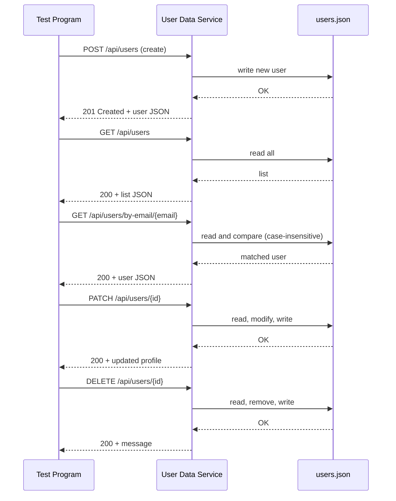

# User Data Management Microservice

A FastAPI-based microservice for managing user profiles. This README documents the communication contract (endpoints, request/response formats), example calls, a simple UML sequence diagram, and how to run the provided test program that demonstrates the service behavior.

## Communication Contract (Stable)

All endpoints return JSON and use standard HTTP status codes. The contract below must remain stable for teammates to interact with this microservice.

- Base path: `/api/users`

Endpoints:

- POST `/api/users`
  - Purpose: Create a new user profile.
  - Request JSON fields:
    - `firstName` (string, required, non-empty)
    - `lastName` (string, required, non-empty)
    - `bio` (string, optional)
    - `dateOfBirth` (YYYY-MM-DD, optional)
    - `location` (string, optional)
    - `email` (string, optional)
    - `phone` (string, optional)
  - Response: 201 Created with the created user object, including numeric `id`.
  - Errors: 422 for validation failures.

- GET `/api/users`
  - Purpose: Return a JSON array of all user profiles.
  - Response: 200 OK with list (may be empty).

- GET `/api/users/{user_id}`
  - Purpose: Return a single user profile by `id`.
  - Response: 200 with user object, or 404 if not found.

- GET `/api/users/by-email/{email}`
  - Purpose: Lookup a user by email (case-insensitive).
  - Response: 200 with user object, or 404 if not found.

- GET `/api/users/by-phone/{phone}`
  - Purpose: Lookup a user by phone; service normalizes to digits only before comparison.
  - Response: 200 with user object, or 404 if not found.


## Example Calls (Programmatic)

Using Python `requests` (create user):

```python
import requests

BASE = "http://localhost:8000"
payload = {
    "firstName": "Alice",
    "lastName": "Johnson",
    "email": "alice@example.com",
    "phone": "(555) 987-6543"
}
resp = requests.post(f"{BASE}/api/users", json=payload)
print(resp.status_code, resp.json())
```

Using Python `requests` (get by id):

```python
import requests

BASE = "http://localhost:8000"
resp = requests.get(f"{BASE}/api/users/1")
print(resp.status_code, resp.json())
```

Example successful create response (201):

```json
{
  "id": 1,
  "firstName": "Alice",
  "lastName": "Johnson",
  "email": "alice@example.com",
  "phone": "(555) 987-6543"
}
```

## How to programmatically REQUEST data (examples)

Below are Python `requests` examples that mirror the style used in the other service READMEs. These show how to call each endpoint programmatically.

Create user example:

```python
import requests

BASE = "http://localhost:8000"
payload = {
  "firstName": "Charlie",
  "lastName": "Example",
  "email": "charlie@example.com",
  "phone": "555-000-1111"
}
resp = requests.post(f"{BASE}/api/users", json=payload, timeout=5)
print(resp.status_code)
print(resp.json())
# On success (201): the created user object with an `id` field is returned
```

Get user by id example:

```python
import requests

BASE = "http://localhost:8000"
user_id = 1
resp = requests.get(f"{BASE}/api/users/{user_id}", timeout=5)
print(resp.status_code)
print(resp.json())
# 200 -> user object, 404 -> {'detail': 'User not found'}
```

Get user by email example (case-insensitive):

```python
import requests

BASE = "http://localhost:8000"
email = "Charlie@Example.com"
resp = requests.get(f"{BASE}/api/users/by-email/{email}", timeout=5)
print(resp.status_code)
print(resp.json())
```

Get user by phone (numeric normalization):

```python
import requests

BASE = "http://localhost:8000"
phone = "(555)000-1111"
resp = requests.get(f"{BASE}/api/users/by-phone/{phone}", timeout=5)
print(resp.status_code)
print(resp.json())
```

Update user (PATCH) example:

```python
import requests

BASE = "http://localhost:8000"
user_id = 1
payload = {"lastName": "Updated"}
resp = requests.patch(f"{BASE}/api/users/{user_id}", json=payload, timeout=5)
print(resp.status_code)
print(resp.json())
```

Delete user example:

```python
import requests

BASE = "http://localhost:8000"
user_id = 1
resp = requests.delete(f"{BASE}/api/users/{user_id}", timeout=5)
print(resp.status_code)
print(resp.json())
```

## How to programmatically RECEIVE and parse data

When calling the service from Python, always check the response status code before using `resp.json()`.

```python
resp = requests.post(f"http://localhost:8000/api/users", json=payload, timeout=5)
if resp.status_code in (200, 201):
  data = resp.json()
  # handle success
else:
  try:
    error = resp.json().get("detail")
  except Exception:
    error = resp.text
  print("Error:", resp.status_code, error)
```

## UML Sequence Diagram

Below is a simple sequence diagram showing how the test program interacts with this microservice and the local storage file. (Mermaid syntax; if your viewer doesn't render mermaid, treat it as pseudocode.)

